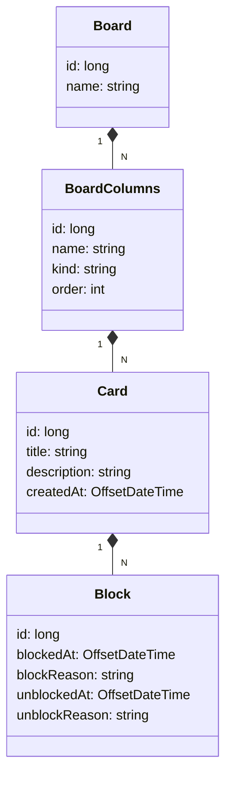

#📋 Decola Tech 2025 - Board
Um Board de Tarefas desenvolvido em Java como parte do programa Decola Tech 2025 da DIO. Este projeto implementa funcionalidades essenciais para gerenciar quadros de tarefas com uma arquitetura robusta e tecnologias modernas.

🚀 Objetivo
Este projeto visa criar uma aplicação para gerenciamento de tarefas com foco em organização, escalabilidade e boas práticas no desenvolvimento de APIs utilizando Java e o ecossistema Spring.

🛠️ Tecnologias Utilizadas
As principais ferramentas e tecnologias usadas no projeto:

Java 21: Linguagem de programação moderna e poderosa.

Spring Boot 3.4.3: Framework para criar aplicações em Java com configuração simplificada.

Spring Data JPA: Abstração para interagir com bancos de dados relacionais.

Liquibase: Controle de versão do esquema do banco de dados.

MySQL: Sistema de gerenciamento de banco de dados relacional.

📐 Arquitetura da API
Diagrama de Classes
O diagrama abaixo representa a estrutura do domínio da aplicação:

